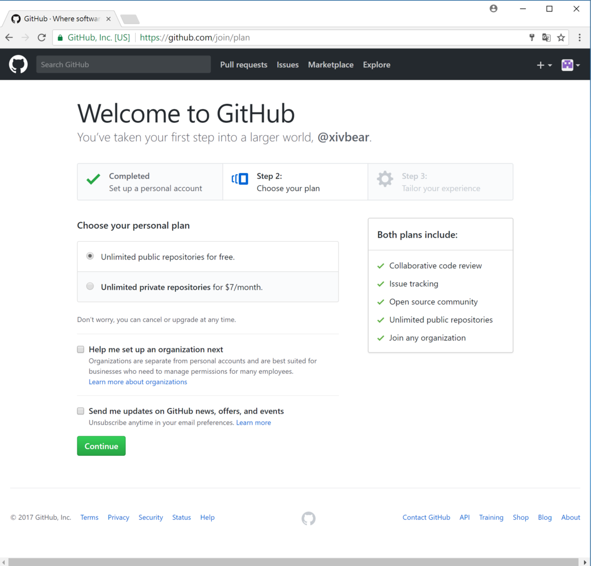
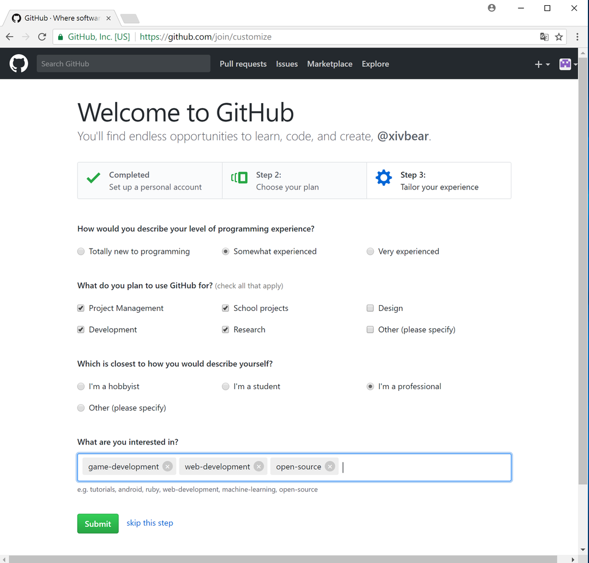
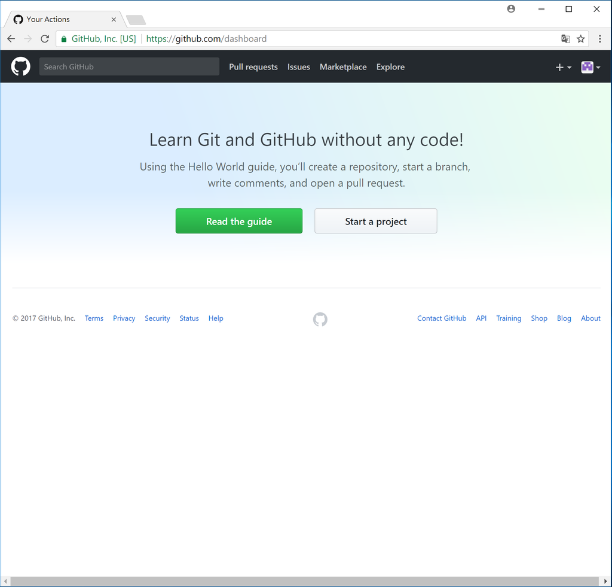
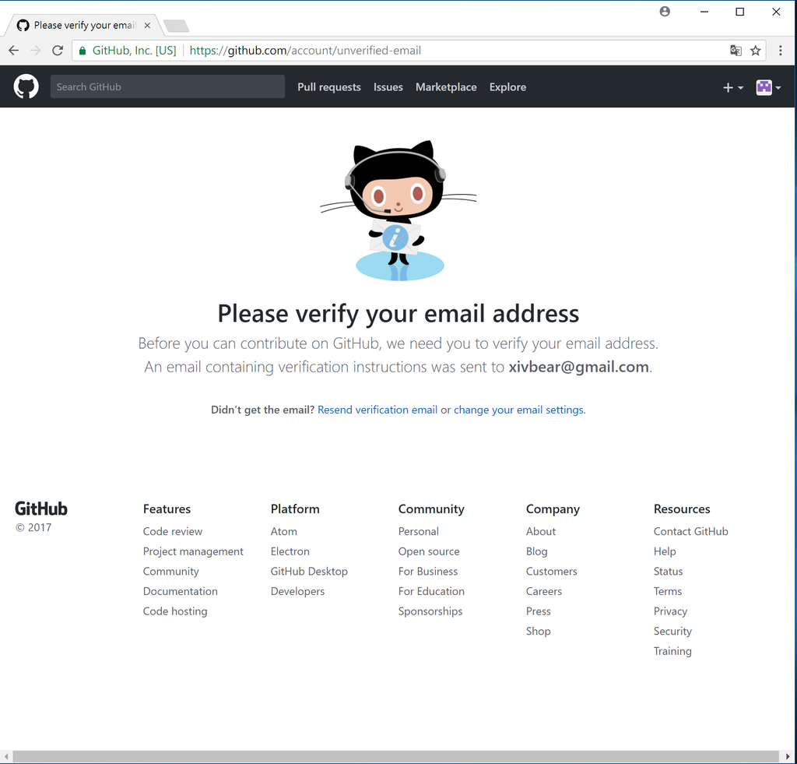
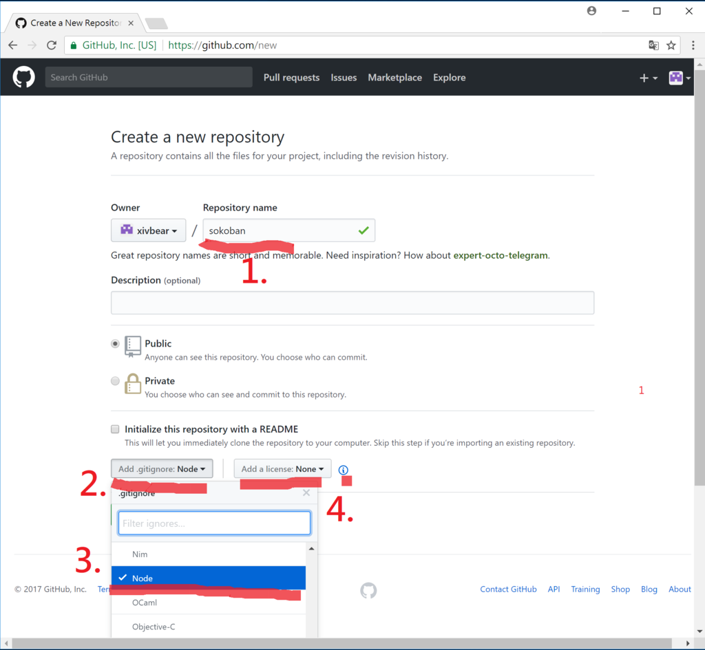
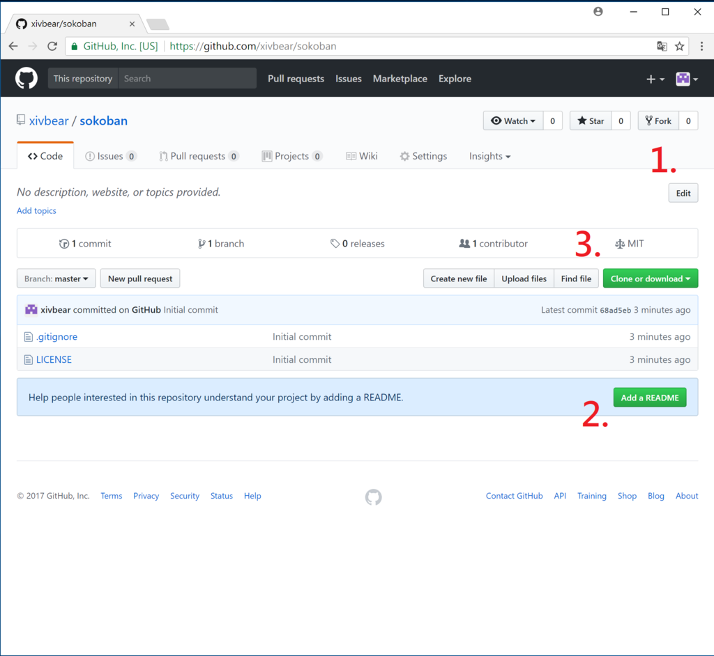
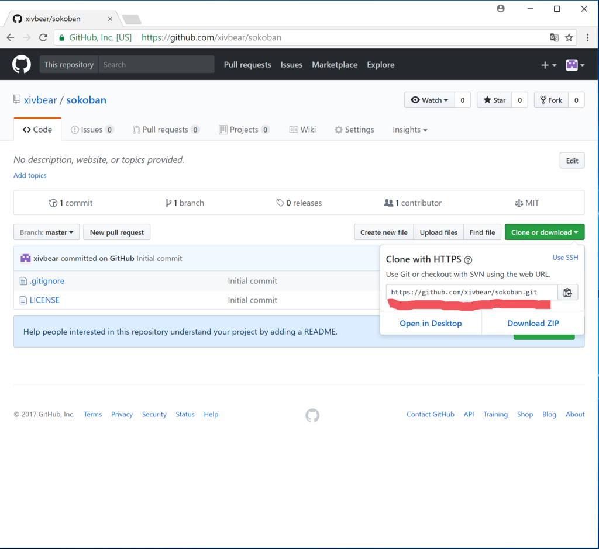
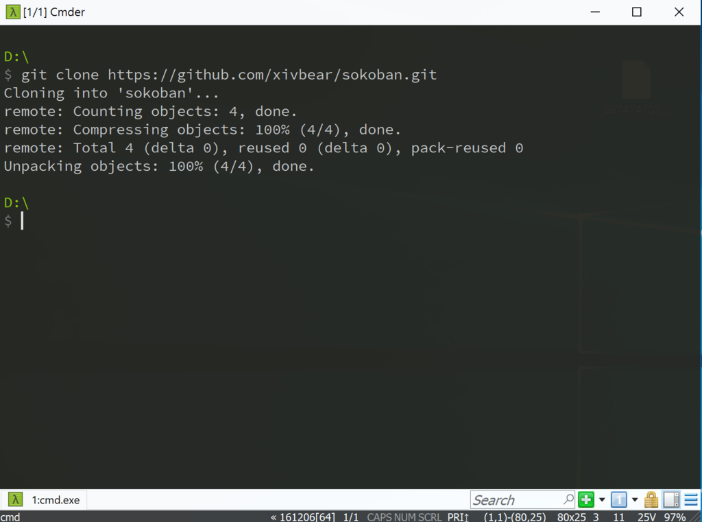

<!---
  @file       github.md
  @author     Yiwei Chiao (ywchiao@gmail.com)
  @date       09/21/2017 created.
  @date       09/23/2017 last modified.
  @version    0.1.0
  @copyright  CC-BY, (C) 2017 Yiwei Chiao
-->

# GitHub 基本使用

## 登錄 (sign up) GitHug 帳號

  1. [GitHub][github] 的登錄畫面很簡單，如圖。僅需要障號名稱，電子信箱，
    和密碼。

    

    登錄完記得回信箱收認証信。

  1. 用新建的帳號登入後，因為是首次登入，[GitHub][github] 會讓你選擇服務類
    型：

    

    [GitHub][github] 預設是免費，無限的開源專案；如果你想付點錢將專案藏起來，它也有選項給你。

    按左下方綠色的 Continue 繼續。

  1. 第三個畫面會問你一些簡單，不涉隱私的資料，可以選擇回答，也可以跳過。

    

  1. 終於到最後一個畫面了，

    

    左邊的按鈕是 [GitHub][github] 教學，右邊則是 **建立專案**，選擇
    **建立專案**。

    如果之前還沒有去登錄的信箱收取認証信，這時你會看到：

    

    記得回登錄的信箱去收認証信。

## 建立專案 (project)  

  在 [GitHub][github] 建立新專案，也稱作建立一個 *repository*，
  其實就是在檔案系統裡建立個存放程式碼相關檔案的資料夾 (folder)。如圖。

  

  1. 首先輸入 **專案** 名稱
  1. 選擇 [.gitignore][gitignore] 檔案；這裡 [GitHub][github] 貼心的
    幫忙準備了不同語言專案的通用 [.gitignore][gitignore] 檔。下拉選擇
    [Node][nodejs]。[.gitignore][gitignore] 檔案的作用與目的後面說明。
  1. 因為 [sokoban.js][sokobanjs] 是 [Node.js][nodejs] 的專案，所以
    這裡先選擇 [Node][nodejs]
  1. 授權方案 (License)。如果不知道該選那種授權或想多少理解一些不同授權的
    差別，旁邊的 *i* 按下去，有簡單的白話說明。個人一般選擇 [MIT][MIT]。

  這裡按下 *Create Repository* 之後，就會進入專案的主頁 (homepage) 畫面。

### [.gitignore][gitignore]

    [.gitignore][gitignore] 檔案一個簡單的文字檔，用來記錄 *不需要* 放在
    *repository* 裡的檔案，檔案類型，與資料夾等資訊。

    舉例而言， C/C++ 的 .o/.obj 檔案， Java 的 .class 檔案，一般意義的
    tmp/ 資料夾，都是專案進行/程式編譯過程中，由工具產生的過渡產物，和我們的工作沒有直接關係，因此沒有必要放到 *repository* 內。

    因為不同的程式語言，不同的工具會有不同的過渡產出，[git][git] 不可能事先知
    道，所以 [git][git] 將決定權放到使月者手裡，由使用者編輯 [.gitignore][gitignore] 檔案，告訴它那些檔案，資料夾是不重要，不需要管厘的。

    [.gitignore][gitignpre] 檔名前面那個 **句點** (*period*, *dot*)，
    **不是** 打錯字，它是檔名的 **一部份**。

    檔名由 **句點** (*period*, *dot*) 開始，在 Linux/MacOS 環境下代表
    **隱藏檔** (*hidden*)，意思是當使用者下 `dir` 或 `ls` 這類列出資料夾
    內容的指令時，系統 **不會** 顯示它的存在。

    而在 Windows 環境下，這個 **句點** (*period*, *dot*) **沒有** 作用，
    就只是檔名的一部份而已。

    如果對這個 **句點** 覺得多餘，請記得 [git][git] 的原作者是
    [Linus Torvalds][torvalds]，也就是 Linux 核心的原作者。

## 專案主頁

  [GitHub][github] 上每個專案的 **主頁** (*homepage*)，都如圖所示：
  這張圖因為是剛產生的專案，所以看起來空空的，可以開始動手添加些資訊。

  

  1. 按下 *Edit* 可以加上網頁的說明。
  1. 按下 *Add a README* 會進入網頁編輯器的畫面，編輯 *README.md* 檔案。說
    明這個專案的細節。等等再回頭來談關於 *README.md* 的事，現在先略過。
  1. 我們現在關心的是這個 *Clone or download*。展開後是這樣，

    

    這裡可以選擇將整個專案壓成一個 .zip 檔案下載，或者用 [GitHub][github]
    的客戶端下載。但目前我們關心的是圖中畫紅線的 *url*。

    開啟 **命令提示字元** (或者，如果有安裝的話， [cmder][cmder]；
    如果 Linux/MacOS，開啟 *terminal*。)

    輸入：`git clone your_url`；
    比如，`git clone https://github.com/xivbear/sokoban.git`

    然後，專案源碼就下載到本地端 (local) 的硬碟裡了。如圖。

    

    之後的專案開發就會在本地端的這個資料夾下工作；再利用 [git][git] 同步到
    [GitHub][github] 上。

## *README.md*

  *README* (讀我) 檔案用來記錄的專案的介紹，說明，注意事項等事宜。理想上，是
  專案使用者首先要閱讀的文件。因為使用者通常缺少耐心，所以 *README* 檔案裡最好
  只放關於專案的 **簡單介紹** 和 *一定* 要事先知道的 **注意事項**。

  *README.md* 裡的 [.md][markdown] 指的則是 [MarkDown][markdown] 標記語言。

### [MarkDown][markdown]

  [MarkDown][markdown] 是一個易學，易讀，易寫，易傳播的文件寫作標記語言。
  目前這份文件就是利用 [MarkDown][markdown] 語言寫的。

  作為一個在網路叢林裡野蠻生長的個體，[MarkDown][markdown] 和 Javascript
  有類似的問題，就是 **方言** (*dialect*) 太多，不同的實作都在某些細節有些
  微妙的不同；或者有不同的語言擴充。

  標準化的努力稱作 [CommonMark][commonmark]，嘗試定義一個最小的共通語言
  核心，並嚴格定義這個核心標準的實作細節。[GitHub][github] 已宣佈在核心部份
  支援 [CommonMark][commonmark]，另外再加上 [GitHub][github] 自己定義
  的 **語言擴充** (*extensions*)。[GitHub][github] 使用的 [MarkDown][markdown] 方言就稱作 *GFM*: GitHub Flavored MarkDown。

  幸運的是，不像 JavaScript，[MarkDown][markdown] 不是程式語言；方言不同
  的影響只是當文件格式需要轉換的時候，如 md <-> HTML， md <-> pdf， md
  <-> epub 等，呈現的效果會有差異，基本上對閱讀的影響不大。

  [GitHub][github] 要求/假定專案說明的 *README* (讀我) 檔案需要以
  [MarkDown][markdown] (*GFM*) 撰寫。

[commonmark]: http://commonmark.org/
[github]: https://github.com
[gitignore]: https://git-scm.com/docs/gitignore
[markdown]: https://en.wikipedia.org/wiki/Markdown
[MIT]: https://opensource.org/licenses/MIT
[nodejs]: https://nodejs.org
[sokobanjs]: https://github.com/ywchiao/sokobna.js

<!--- github.md -->
