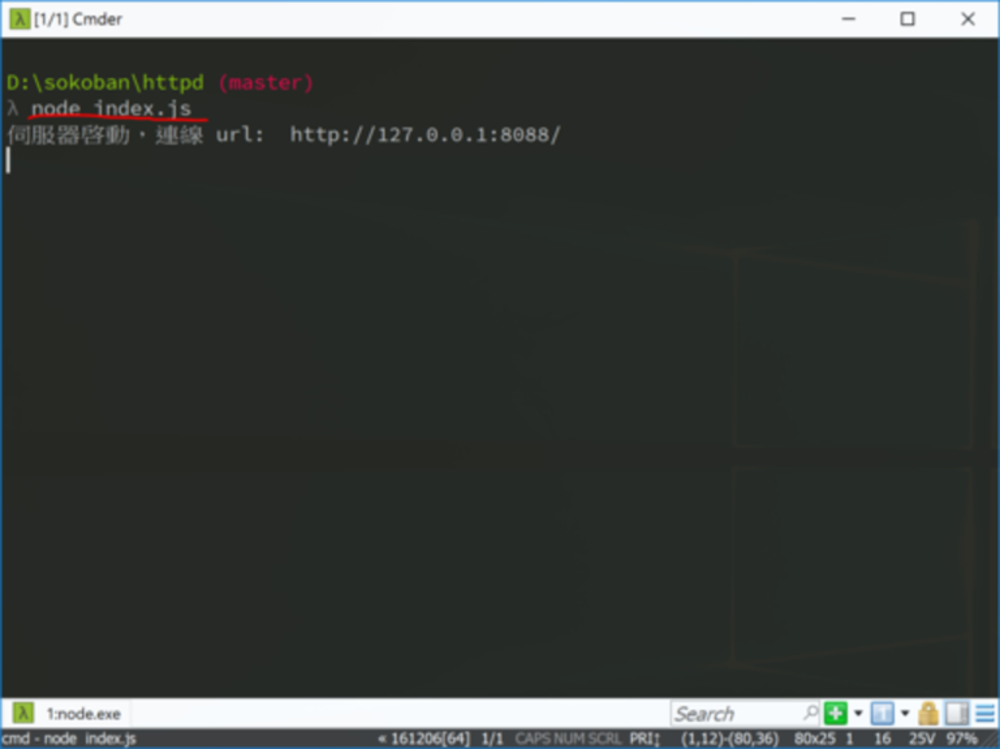
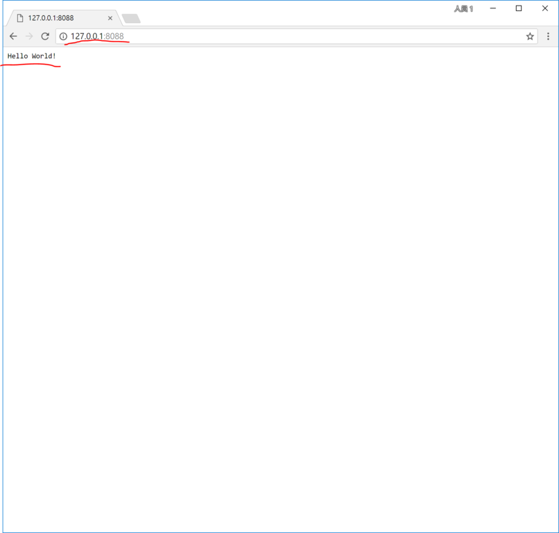

<!---
  @file       hello_world.md
  @author     Yiwei Chiao (ywchiao@gmail.com)
  @date       10/03/2017 created.
  @date       10/06/2017 last modified.
  @version    0.1.0
  @copyright  CC-BY, (C) 2017 Yiwei Chiao
-->

# Hello World

  專案先由傳統的 *Hello World!* 開始。

## `index.js`

  一開始的 `index.js` 的內容如下：

---

**index.js**
```javascript
  1: 'use strict';
  2:
  3: let http = require('http');
  4:
  5: http.createServer((request, response) => {
  6:   // 傳送 HTTP header
  7:   // HTTP Status: 200 : OK
  8:   // Content Type: text/plain
  9:   response.writeHead(200, {
 10:     'Content-Type': 'text/plain'
 11:   });
 12:
 13:   // 傳送回應內容。
 14:   response.end('Hello World!\n');
 15:
 16:   console.log('request.headers: \n', request.headers)
 17: }).listen(8088);
 18:
 19: // log message to Console
 20: console.log('伺服器啓動，連線 url:  http://127.0.0.1:8088/');
```
---

  將 `index.js` 存檔後，在命令提示字元 ([cmder][])/終端機 (terminal) 下，
  輸入 `node index.js`，如圖 Figure \ref{server_start}，

  

  就可以啟動剛剛寫作的簡易網頁伺服器；再利用網頁瀏覽器，依伺服器訊息指示，開啟
   `http://127.0.0.1:8088` 就會看到如下的畫面
   (Figure \ref{hello_world})。

  

## `index.js` 程式說明

  如 Figure \ref{hello_world} 所示，瀏覽器就簡單顯示了 `Hello World!`
  訊息，沒有任何一般網頁的風範。這是因為伺服端真的什麼都沒作，就只送了那兩個英
  文字。比對程式碼，可以發現 `Hello World!` 出現在程式碼的第 14 行。由上下
  文的觀察可以猜出第 5 行到第 17 行是整個回應的核心。下面就來逐行解析這個程式
  的內容。

### Line 1: `'use strict';`

  之前有提過，[JavaScript][] 在 2009 年左右開始了一場標準化的變革，以應對
  愈來愈重要的網頁平台需求。為了擁抱改變，但又不能捨棄過去，所以 [ECMAScript][] 5 [引入][ECMAScript5]了 `strict` 模式。

  `strict` 模式對語法有更嚴格的要求，對過去一些模糊的語法作出了明確的規範或捨
  棄。舉例而言，`strict mode` 要求變數一定要宣告，但傳統的 [JavaScript][]
  不用。更詳細的討論可以見 [MDN][mdn] ([Mozilla Developer Network][mdn])
  對 [strict mode][strict] 的介紹。

  利用 `strict` 模式的宣告讓程式設計師可以有簡單的機制將傳統和新的標準化
  [JavaScript][] 作連結。

  第一行的 `'use strict';` 就是**聲明**這個程式是以 `strict` 模式撰寫。

### Line 3: `let http = require('http');`

  * [let][] 是 [ECMAScript][] 6 (又稱
   [ECMAScript Harmony][ECMAScript5]/[ES Harmony][ECMAScript5]/
   [ES 2015][ECMAScript5]) 引入的 **關鍵字** 之一。用途是 **宣告**一個
   **範圍變數** (scoped variable)；相對於 [var][] 宣告的變數則是 **全域**
   (global vairable) 或與函數綁定 ([closure][])。
  * [require][] 是 [Node.js][nodejs] 提供的 **模組** (module) 系統
   API 函數之一。作用為 **載入** (load) 指定的 [JavaScript][] 模組。這裡
   載入的是名為 [http][httpmod] 的 [Node.js][nodejs] 標準模組。

   透過 [require][] 載入的模組就初始化為一個 [JavaScript][] 的程式物件 (object instance)，可以直接呼叫使用。

   [http][httpmod] 模組是 [Node.js][nodejs] 提供的打造 [HTTP][http]
   服務器或客戶端的核心模組。它會負責處理和網路通訊相關真正麻煩的部份，專案需
   要作的，只是提供它必要的資訊。

### Line 5: `http.createServer(...)`

  * [HTTP.createServer][createserver]  
   如它的名字所示，是 [http][httpmod] 的內建方法，作用就是建立起一個
   http protocol 的伺服物件 ([http.Server][httpserver])。
   [HTTP.createServer][createserver] 要求一個 **函數** 參數:
   `requestListener`。

   因為 http 伺服物件知道如何處理網路協定，但無法知道如何回應使用者要求。這個
   傳入的 `requestListener` 函數就是 [http.Server][httpserver] 物件接
   收到使用者要求 (*request* 事件)時，需要 **呼叫執行** 來回應使用者要求的
   函數。因為 `requestListener` 函數不是由程式設計師在編寫程式時主動呼叫，
   而是由程式物件在程式執行時期自己呼叫，所以稱為： **回呼函數** (*callback*
   function)。  

   Callback function 在類似 [JavaScript][] 這類的函數式語言是個很重要的
   概念。

   `requestListener` 函數需要接收兩個參數：

   - [request][clientrequest]: [JavaScript][] 物件，代表瀏覽器傳遞的使用
     者要求。
   - [response][serverresponse]: [JavaScript][] 物件，用來回傳伺服器想
     傳送給瀏覽器的資料。

   這裡專案程式碼利用 **匿名函數** `(request, response) => {...}` 實作了
   [HTTP.createServer][createserver] 要求的 `requestListener`

  * `(request, response) => {...}`  
   就是 `function (request, response) {...}` 的另一種寫法。也就是宣告了
   一個 **匿名函數** (anonymous function)。  
   `(...) => {...}` 稱為 [*arrow function*][arrowfunction] 除了語法
   (syntax) 的改變外，在語義 (semantic)上，
   [arrow function][arrowfunction] 和傳統函數也有些細節的不同，這裡先略
   過，有興趣可以先去看參考資料。

### Line 9 ~ Line 14: `response`

  上面的 [response][serverresponse] 物件其實是 [Node.js][nodejs] 提供
  的 [ServerResponse][serverresponse] 類別的實例 (instace)。

  [response][serverresponse] 物件回應，基本上可以分為三 (3) 步走：

  1. `ServerResponse.writeHead(statusCode[, statusMessage][, headers])`: 傳送 HTTP header 資訊。
   參見 [ServerResponse.writeHead][responsewritehead]
  1. `ServerResponse.write(chunk[, encoding][, callback])`: 傳送
   回應內容。參見 [ServerReposne.write][responsewrite]。
  1. `ServerResponse.end([data][, encoding][, callback])`:
   回應結束。**一定** 要呼叫。參見 [ServerResponse.end][responseend]。

  由上述流程中可以看到 [ServerResponse.writeHead(...)][responsewritehead]
  基本回應了瀏覽器這次訪問是否成功 (`statusCode`)，瀏覽器應該如何解讀回應
  內容 (`headers`) 等。

  `header` 裡主要是放回應內容的編碼方式 (`encoding='utf8'`)，
  內容型別 ([MIME types][mime]，如: `'Content-Type: text/plain'`)
  等。

  因為這個小程式只需要回應 `'Helo World!`，所以就直接省略了對
  [ServerResponse.write(...)][responsewrite] 的呼叫；直接以
  `'Hello Wrold!'` 作為參數呼叫
  [ServerResponse.end(...)][responseend]。

### Line 16 `console.log(...)`

  [Node.js][nodejs] 的 [console][] 物件代表的就是 **命令提示字元**/
  **終端機** (terminal)。主要用途是 `log` 訊息到螢幕輸出，讓系統管理員能夠
  知道系統發生了些什麼事情。

  而裡面的 [request][clientrequest] 物件是 [Node.js][nodejs] 提供
  的 [ClientRequest][clientrequest] 類別的實例 (instace)。記錄了瀏覽器
  傳送的資料細節。

  目前專案沒有用到它的內容，這裡單純將 `request.headers` 的資訊倒到 [console][] 上。

### Line 17: `listen(8088)`

  到 17 行，整個 [HTTP.createServer(...)][createserver] 就完成了呼叫，
  傳回一個 [http.Server][httpserver] 的實例。但這個伺服物件還沒有起動。
  第 17 行尾端的 [lister(8088)][serverlisten] 就是起動這個伺服物件，同時
  指定它在 *8088* 這個通訊埠 (port) 等待使用者的連線。

### Line 20 `console.log(...)`

  如果一切順利，到這兒，一個 http 伺服程序已經在背後運行，但是沒有任何訊息
  呈現在 [console][]，系統管理員無從判斷系統狀態。所以這裡在 console 印出一個
  提示訊息，說明伺服器已起動，同時印出它的 ip 址地和 port 號碼。

## Javascript 模組系統簡介

  這小節是關於 [JavaScript][] 模組系統的一些簡略背景介紹，和專案程式碼沒有直接
  關係。如果沒有興趣可以跳過。

  傳統 [JavaScript][] 本身沒有模組系統 ([ECMAScript][] 6 之後才有)。程式碼
  不管分成幾個檔案，執行後全部混在一起，所有的變數全部都是 global，包在物件或
  [**閉包**][closure] ([closure][]) 裡。對發展大型專案或初學者而言是個充滿
  陷阱的雷區。

  為解決這個問題，[Node.js][nodejs] 和其它一些 [JavaScript][] 的函式庫，
  利用 [JavaScript][] 的物件 (objects) 和 [closure][] 建構了自己的模組
  系統。當然，各家的實作方法都不太相同。為了保持中立，[ECMAScript][] 6 提出
  的模組系統 **當然** 又是另一種。所以說，[JavaScript][] 是個充滿新鮮感與
  驚奇的語言。

  [Node.js][nodejs] 使用的模組系統繼承自 [CommonJS][commonjs]，為伺服
  端 [JavaScript][] 程式；另一個廣泛使用的格式稱作
  [AMD][amd] ([Asynchronous Module Definition][amd]) 是針對 Web 瀏覽器
  設計；最後一種，稱為
  [IIFE][iife] ([Immediately-Invoked Function Expression][iife])。
  [IIFE][iife] 本身其實是應用 [JavaScript][] function 物件的一個進階程式
  技巧，並不是什麼模組系統。但實作簡單，應用廣泛，在這個專案的進行中也會引入
  [IIFE][iife] 的寫作方式。

  [Sokoban.js][sokobanjs] 專案在：

  * 伺服端，使用 [Node.js][nodejs]，使用 [Node.js][nodejs] 的模組系統。
  * 客戶端，使用 [ECMAScript][] 6 的模組系統。

[amd]: http://requirejs.org/docs/whyamd.html
[arrowfunction]: https://developer.mozilla.org/zh-TW/docs/Web/JavaScript/Reference/Functions/Arrow_functions
[clientrequest]: https://nodejs.org/api/http.html#http_class_http_clientrequest
[closure]: https://developer.mozilla.org/zh-TW/docs/Web/JavaScript/Closures
[commonjs]: http://www.commonjs.org
[console]: https://nodejs.org/api/console.html#console_class_console
[createserver]: https://nodejs.org/api/http.html#http_http_createserver_requestlistener
[ECMAScript]: https://www.ecma-international.org/publications/standards/Ecma-262.htm
[ECMAScript5]: https://en.wikipedia.org/wiki/ECMAScript      
[http]: https://en.wikipedia.org/wiki/Hypertext_Transfer_Protocol
[httpmod]: https://nodejs.org/api/http.html#http_http
[httpserver]: https://nodejs.org/api/http.html#http_class_http_server
[iife]: https://en.wikipedia.org/wiki/Immediately-invoked_function_expression
[JavaScript]: https://developer.mozilla.org/zh-TW/docs/Web/JavaScript
[let]: https://developer.mozilla.org/zh-TW/docs/Web/JavaScript/Reference/Statements/let
[mdn]: https://developer.mozilla.org/zh-TW
[mime]: https://developer.mozilla.org/en-US/docs/Web/HTTP/Basics_of_HTTP/MIME_types
[nodejs]: https://nodejs.org/en
[require]: https://nodejs.org/api/modules.html#modules_require
[responseend]: https://nodejs.org/api/http.html#http_response_end_data_encoding_callback
[responsewrite]: https://nodejs.org/api/http.html#http_response_write_chunk_encoding_callback
[responsewritehead]: https://nodejs.org/api/http.html#http_response_writehead_statuscode_statusmessage_headers
[serverlisten]: https://nodejs.org/api/http.html#http_server_listen_port_hostname_backlog_callback
[serverresponse]: https://nodejs.org/api/http.html#http_class_http_serverresponse
[sokoban]: https://en.wikipedia.org/wiki/Sokoban
[sokobanjs]: https://github.com/ywchiao/sokoban.js.git
[strict]: https://developer.mozilla.org/en-US/docs/Web/JavaScript/Reference/Strict_mode
[var]: https://developer.mozilla.org/zh-TW/docs/Web/JavaScript/Reference/Statements/var

<!--- hello_world.md -->
